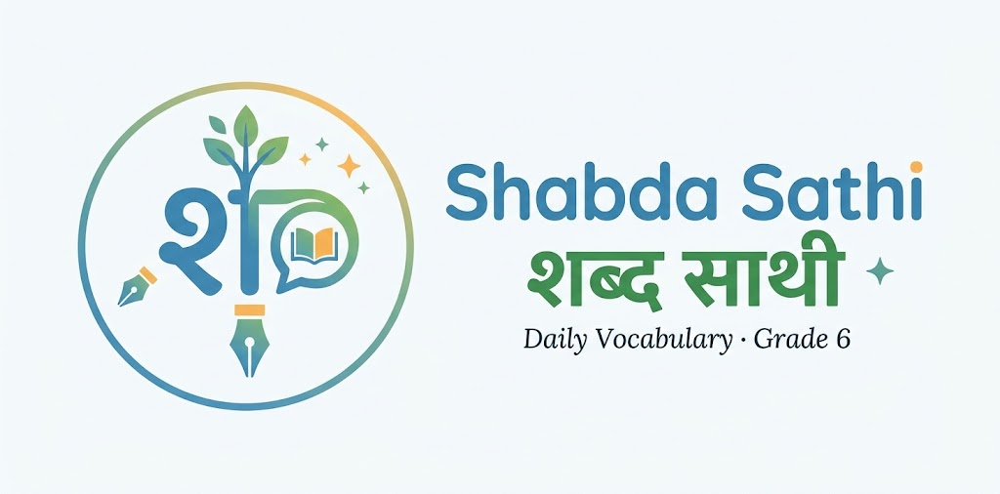

# Shabda Sathi (शब्द साथी) 📘

> **Daily Vocabulary Practice for Grade 6 Students**  
> Tailored for boarding school students in Kathmandu, Nepal.



## Overview
**Shabda Sathi** is an interactive, date-synced daily English vocabulary builder designed specifically for Grade 6 students. It guides students through a structured 6-month journey (from October 2026 to April 2027) with 6 carefully chosen, medium-level vocabulary words per day.

## Key Features
- **Curated Grade 6 Vocabulary**: 1,110+ unique words with:
  - English Headword & Pronunciation audio (`🔊`)
  - Clear Nepali Meaning (नेपाली अर्थ)
  - Synonyms & Antonyms
- **Calendar Hierarchy (Month ➔ Week ➔ Day)**: Easily navigate through months and weeks.
- **Smart Date-Locking Mechanism**:
  - Future dates remain locked with a live countdown timer until their calendar date.
  - Automatically unlocks new daily words at midnight.
  - Missed past days remain accessible in "Catch-Up" mode.
- **Self-Testing Practice Mode**: Toggle to hide Nepali meanings to practice active recall.
- **Progress Tracking & Streaks**: Automatically tracks daily streaks and completion status using local device storage.
- **Multiple Visual Themes**:
  - ☀️ **Clean & Cheerful**: High contrast, light learning theme (inspired by Duolingo/Khan Academy).
  - 📜 **Warm Book / Paper**: Soft ivory dictionary aesthetic.
  - 🌙 **Soft Slate Dark**: Gentle dark mode for night study.

## Getting Started
Simply clone the repository and open `index.html` in any modern web browser:
```bash
git clone https://github.com/kabu631/Word-Learner-for-Kids.git
cd Word-Learner-for-Kids
```
To run with the included zero-dependency Node server:
```bash
node server.js
```
Then visit `http://localhost:3000` in your browser.
